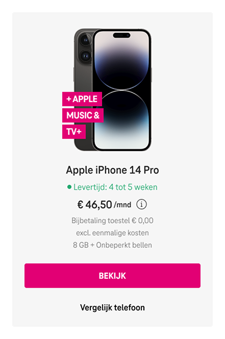
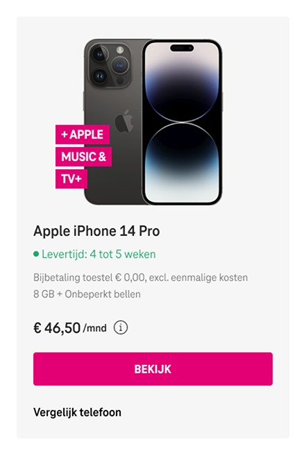

# Intro

This project contains a basic setup to get you up and running for building the assignment. 

# Assignment Part 1 - Vue.JS

Create a [product listing page](https://www.t-mobile.nl/shop/alle-telefoons?ch=es&cc=con&sc=acq) with Vue.js, you can find an example from [here](https://www.t-mobile.nl/shop/alle-telefoons?ch=es&cc=con&sc=acq).

1. Use [Vue.js](https://vuejs.org/) to build the application
2. The user should be able to filter on brand (multiple selectable)
3. Render the products (use this JSON for example `offering-GAP59.json`).
4. Make sure you structure your components in such a way that's easy to maintain in the future.

## Data

Additional information about the JSON's

- You can find all brands in `brands.json`
- You can find all product services (data + voice bundles) within `core-services.json`
- Devices are always sold with a product service (data + voice bundle), which determines the monthly cost of the subscription. You can find all combinations within `offering-{CODE}.json`

## How to start the project

To run the development enviroment please make sure you first run `npm install`. After all Node packages are installed, you can run the develpoment environment with `npm run dev`.

## Vite

This project uses [Vite](https://vitejs.dev/) for bundling.

# Assignment Part 2 - A/B Test

After completing part 1 of the assignment you need to create an A/B test for the Product Listing Page. The current version should look like this:

**Control:**

Create a piece of JavaScript code that modifies the HTML elements and styling to make it look like the variant.

- Only use plain/vanilla JavaScript 
- Modify, replace of move HTML elements with JavaScript
- Overwrite styling with JavaScript

**Variant:**

To show the variant you need to be able to run the code from the browser console.